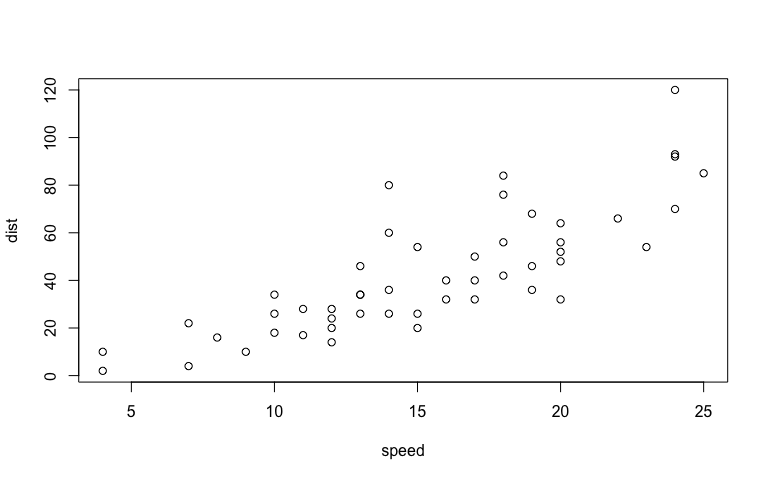
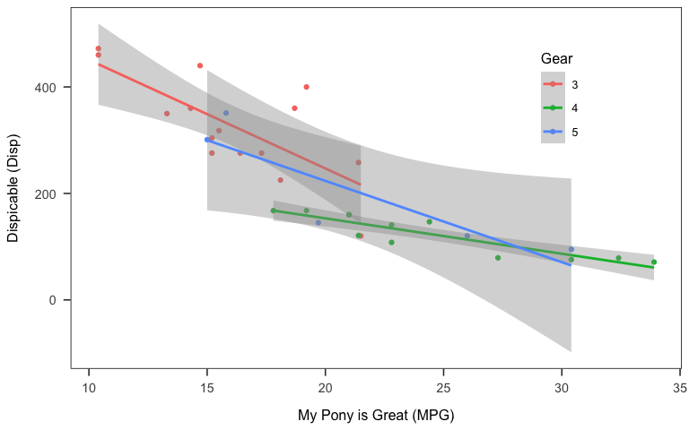

# R environment 


# Structure 
## Header
### Metadata in the Header (YAML)


translate the argument into YAML using `yaml::as.yaml`.

```r
cat(yaml::as.yaml(list(
  title = "example document",
  author = "su so"
)))
```

```
## title: example document
## author: su so
```

Essential components:
1. output format
  + `html_document`
  + `word_document`
  + `pdf_document`
  
2. `bibliography`
use [@R-base] 

## Code chunks
### Step 1. Insert code chunks
Keyboard shortcuts:
- Ctrl + Alt + I (Windows)
- Cmd + Option + I (Mac)

### Step 2. Define *chunk options*


#### Options for the output documents
A full list of options available [here](https://yihui.name/knitr/options/).

*`eval`: execute a code chunk?
*`echo`: include the source code in the output document?
  +selective inclusion: e.g., `echo=3:5` 

```r
x <- c("a", "b", "c") #3
y <- c(1:3) #4
cbind(x, y) #5
```

```
##      x   y  
## [1,] "a" "1"
## [2,] "b" "2"
## [3,] "c" "3"
```

*`results`:
  +`hide`: hide result in the text output?
  +`asis`: 

```r
cat("This is how results are written\n as is.")
```

This is how results are written
 as is.
*`warning`, `message`, `error`: show warnings and (error) messages in the output document?
*`include`: do not show in the output document (but still run the code chunk)
  +equivalent to `echo=F, results='hide', warning=F, message=F`
*`cache`: computations are saved to prevent re-running the code chunk (unless there are changes)
  +`audodep`: if a code chunk that subsequent code chunks depend on changes 

#### Options for the figures & plots
*`fig.width` and `fig.height` define plots in inches. 
  +`fig.dim = c(6, 4)` is equivalent to  `fig.width=6, fig.height=4`

### Step 3. Code away
#### Create a plot

```r
plot(cars)
```

<!-- -->

As shown in \@ref(fig1), there is a relationship.

APA-formatted Plot

```r
ggplot(mtcars, aes(x = mpg, y = disp, colour = as.factor(mtcars$gear))) +
  geom_point() +
  geom_smooth(method = "lm") +
  labs(x = "My Pony is Great (MPG)",
       y = "Dispicable (Disp)") +
  scale_color_discrete("Gear") +
  papaja::theme_apa(box = T) +
  theme(legend.position = c(0.8, 0.75))
```

<!-- -->

```r
ggsave("plot.png", width = 8, height = 5)
# unlink("plot.png")
```

Import figures

```r
knitr::include_graphics(here("plot.png"))
```


#### table
Using `knitr::kable`

```r
mtcars %>%
  summarise(n = n(),
            disp_mean = mean(disp, na.rm = T),
            disp_sd = sd(disp, na.rm = T)) %>%
  as.tibble() %>%
knitr::kable(booktabs = T,
             caption="Summary Table",
             digits = 2)
```


Table: Summary Table

  n   disp_mean   disp_sd
---  ----------  --------
 32      230.72    123.94

Test statistics 

```r
knitr::kable(coef(summary(lm(disp ~ wt*as.factor(gear),
                             data = mtcars))),
             digits = 2)
```

                       Estimate   Std. Error   t value   Pr(>|t|)
--------------------  ---------  -----------  --------  ---------
(Intercept)              -50.16        56.99     -0.88       0.39
wt                        96.71        14.34      6.75       0.00
as.factor(gear)4          26.55        80.74      0.33       0.74
as.factor(gear)5         -66.28        93.83     -0.71       0.49
wt:as.factor(gear)4      -40.68        25.67     -1.58       0.13
wt:as.factor(gear)5       24.43        30.82      0.79       0.44


```r
knitr::kable(broom::tidy(lm(disp ~ wt*as.factor(gear),
                             data = mtcars)),
             digits = 3)
```


term                   estimate   std.error   statistic   p.value
--------------------  ---------  ----------  ----------  --------
(Intercept)             -50.162      56.985      -0.880     0.387
wt                       96.712      14.336       6.746     0.000
as.factor(gear)4         26.550      80.737       0.329     0.745
as.factor(gear)5        -66.280      93.834      -0.706     0.486
wt:as.factor(gear)4     -40.676      25.671      -1.585     0.125
wt:as.factor(gear)5      24.431      30.819       0.793     0.435

## Text paragraphs

### inline formatting  
[Basic formatting](https://rmarkdown.rstudio.com/authoring_basics.html)  

#### equation

```r
summary(lm.fit <- lm(disp ~ as.factor(gear)*wt,
                     data = mtcars))
```

```
## 
## Call:
## lm(formula = disp ~ as.factor(gear) * wt, data = mtcars)
## 
## Residuals:
##     Min      1Q  Median      3Q     Max 
## -74.125 -21.352  -4.293  23.814  83.417 
## 
## Coefficients:
##                     Estimate Std. Error t value Pr(>|t|)    
## (Intercept)           -50.16      56.99  -0.880    0.387    
## as.factor(gear)4       26.55      80.74   0.329    0.745    
## as.factor(gear)5      -66.28      93.83  -0.706    0.486    
## wt                     96.71      14.34   6.746  3.7e-07 ***
## as.factor(gear)4:wt   -40.68      25.67  -1.585    0.125    
## as.factor(gear)5:wt    24.43      30.82   0.793    0.435    
## ---
## Signif. codes:  0 '***' 0.001 '**' 0.01 '*' 0.05 '.' 0.1 ' ' 1
## 
## Residual standard error: 44.68 on 26 degrees of freedom
## Multiple R-squared:  0.891,	Adjusted R-squared:   0.87 
## F-statistic:  42.5 on 5 and 26 DF,  p-value: 1.058e-11
```
$y_{ij}$ = $\beta_0 + \beta_1 age + e$ 

...a positive slope, $\beta$ = 96.71, $p$ = 0

r-squared:
$R^2$

chi-square: 
$\chi^2$ 

For more LaTex [math symbols](http://web.ift.uib.no/Teori/KURS/WRK/TeX/symALL.html)

#### block quote
> ...As this pseudo-workshop dragged on, the scholars have struggled to sit through the talk. People wondered, when is this misery going to end?
>
> --- scholars

#### footnote
^[1]
^[1]: This is where a foot notes.


### Citing references  

Add the following lines in the YAML header:
---
csl: apa.csl
bibliography: reference.bib
---

2. cite away
[see @hall_engineering_2015; also @joel_wanting_2017]. 
Will Michael Hall said [-@hall_engineering_2015]...

#### citr add-in

```r
# install.packages("citr")
options(citr.use_betterbiblatex = T)
```

#### papja
Step 1. `papaja::r_refs` to create a bib file 
  + .bib file will include citations for R and R packages used in the session. 

```r
papaja::r_refs(file = "zotero_ref.bib")
```

Step 2. `papja::cite_r` to translate them into human-readable citations

```r
citations <- papaja::cite_r(file="zotero_ref.bib"
                    #, pkgs = c("papaja", "here") 
                    #, withhold = F
                    #, footnote = T
                    )
```
I used R [Version 3.5.1; @] and the R-packages *}base* [@}R-base], *bindrcpp* [Version 0.2.2; @R-bindrcpp], *dplyr* [Version 0.7.7; @R-dplyr], *forcats* [Version 0.3.0; @R-forcats], *ggplot2* [Version 3.1.0; @R-ggplot2], *here* [Version 0.1; @R-here], *knitr* [Version 1.20; @R-knitr], *purrr* [Version 0.2.5; @R-purrr], *readr* [Version 1.1.1; @R-readr], *shiny* [Version 1.1.0; @R-shiny], *stringr* [Version 1.3.1; @R-stringr], *tibble* [Version 1.4.2; @R-tibble], *tidyr* [Version 0.8.2; @R-tidyr], and *tidyverse* [Version 1.2.1.9000; @R-tidyverse] for the data analysis.

# Creating your own workflow
## 1. Importing a dataset from the master script


## 2. Run analyses like a boss
### Eligibile participants


### Demographics

```r
(demographics <- df %>%
  # group_by(attn_check) %>%
   filter(exclusion == "eligible") %>%
  summarise(n = n(),
            age = mean(age, na.rm = T),
            female = length(which(gender == "female")),
            male = length(which(gender == "male"))))
```

```
## # A tibble: 1 x 4
##       n   age female  male
##   <int> <dbl>  <int> <int>
## 1   205  33.3     90   113
```
In a sample of 205 participants...

### Regression analyses


# Resources
1. [cheetsheet](https://www.rstudio.com/wp-content/uploads/2015/02/rmarkdown-cheatsheet.pdf)

\newpage
# References
