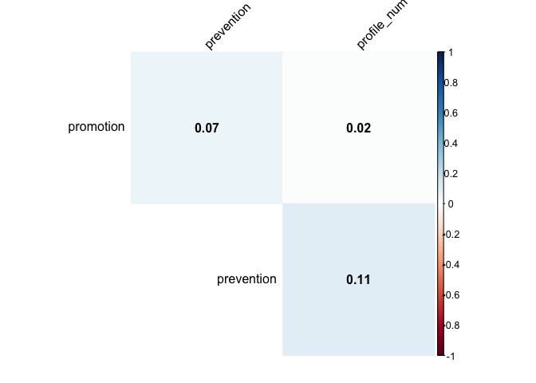
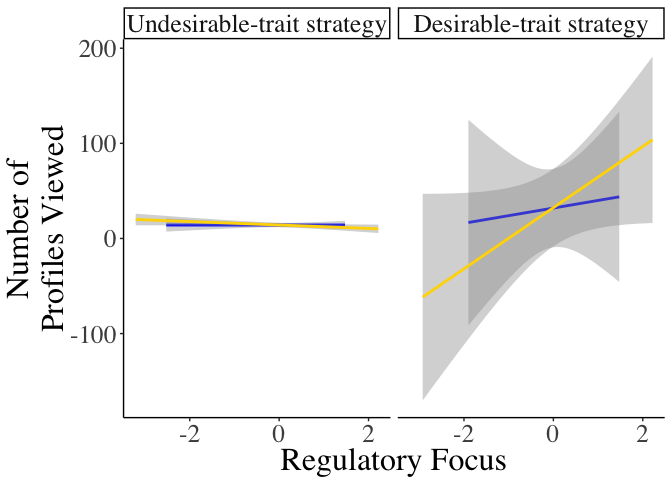

# Setting the environment 
This won't be shown in your document


For reproducibility, two options for recording packages used:  
a) using `checkpoint` package

```r
checkpoint::checkpoint(Sys.Date()) # create a snapshot folder for all the install pakges
getOption("repos") # check that the CRAN mirror set to MRAN snapshot
```

```
##     CRAN 
## "@CRAN@"
```

b) Record session informations using `sessionInfo()`  

```r
print(sessionInfo(), locale = FALSE)
```

```
## R version 3.5.1 (2018-07-02)
## Platform: x86_64-apple-darwin15.6.0 (64-bit)
## Running under: macOS  10.14.1
## 
## Matrix products: default
## BLAS: /Library/Frameworks/R.framework/Versions/3.5/Resources/lib/libRblas.0.dylib
## LAPACK: /Library/Frameworks/R.framework/Versions/3.5/Resources/lib/libRlapack.dylib
## 
## attached base packages:
## [1] stats     graphics  grDevices utils     datasets  methods   base     
## 
## other attached packages:
##  [1] DT_0.4               bindrcpp_0.2.2       here_0.1            
##  [4] broom_0.5.0          forcats_0.3.0        stringr_1.3.1       
##  [7] dplyr_0.7.7          purrr_0.2.5          readr_1.1.1         
## [10] tidyr_0.8.2          tibble_1.4.2         ggplot2_3.1.0       
## [13] tidyverse_1.2.1.9000
## 
## loaded via a namespace (and not attached):
##  [1] tidyselect_0.2.5 haven_1.1.2      lattice_0.20-35  colorspace_1.3-2
##  [5] htmltools_0.3.6  yaml_2.2.0       rlang_0.3.0.1    pillar_1.3.0    
##  [9] glue_1.3.0       withr_2.1.2      modelr_0.1.2     readxl_1.1.0    
## [13] bindr_0.1.1      plyr_1.8.4       munsell_0.5.0    gtable_0.2.0    
## [17] cellranger_1.1.0 rvest_0.3.2      htmlwidgets_1.3  codetools_0.2-15
## [21] evaluate_0.12    checkpoint_0.4.4 knitr_1.20       Rcpp_1.0.0      
## [25] scales_1.0.0     backports_1.1.2  jsonlite_1.5     hms_0.4.2       
## [29] digest_0.6.18    stringi_1.2.4    grid_3.5.1       rprojroot_1.3-2 
## [33] cli_1.0.1        tools_3.5.1      magrittr_1.5     lazyeval_0.2.1  
## [37] crayon_1.3.4     pkgconfig_2.0.2  xml2_1.2.0       lubridate_1.7.4 
## [41] assertthat_0.2.0 rmarkdown_1.10   httr_1.3.1       rstudioapi_0.8  
## [45] R6_2.3.0         nlme_3.1-137     compiler_3.5.1
```

## 1. Importing a dataset from the master script

```r
source(here("data_analysis", "data_analysis_prep.R"))
```

## 1.5 Prep your data
### Eligibile participants

```r
df <- df %>%
  mutate(exclusion = case_when(
    attn_check == "pass" &
      var_low == "acceptable" ~ "eligible",
    TRUE ~ "ineligible"))
```

Check the number of eligible participants

```r
table(df$exclusion)
```

```
## 
##   eligible ineligible 
##        238         50
```

### Center your variables
Create a function to mean-center your continuous variables

```r
mean_c <- function(x) {
  x - mean(x, na.rm = T)
}
```


```r
df <- df %>%
  filter(exclusion == "eligible") %>%
  mutate(prom.c = mean_c(promotion),
         prev.c = mean_c(prevention))
```


## 2. Run analyses like a boss
### Demographics

```r
(demographics <- df %>%
   group_by(exclusion) %>%
   summarize(n = n(),
            age = round(mean(age, na.rm = T),2),
            female = length(which(gender == "female")),
            male = length(which(gender == "male"))) %>%
   ungroup())
```

```
## # A tibble: 1 x 5
##   exclusion     n   age female  male
##   <chr>     <int> <dbl>  <int> <int>
## 1 eligible    238  33.7    100   136
```

In our sample, 238 participants met our eligibile criteria to participate  

### Correlations
Bi-variate correlation using:
a) `psych` package

```r
psych::corr.test(df[ ,c("promotion", "prevention")], 
                 df[ ,c("profile_num", "profile_interest_num")],
                 use = "pairwise",
                 method = "pearson",
                 adjust = "none")
```

```
## Call:psych::corr.test(x = df[, c("promotion", "prevention")], y = df[, 
##     c("profile_num", "profile_interest_num")], use = "pairwise", 
##     method = "pearson", adjust = "none")
## Correlation matrix 
##            profile_num profile_interest_num
## promotion         0.02                 0.01
## prevention        0.11                 0.15
## Sample Size 
## [1] 238
##            profile_num profile_interest_num
## promotion         0.79                 0.86
## prevention        0.10                 0.02
## 
##  To see confidence intervals of the correlations, print with the short=FALSE option
```


b) `Hmisc` package:

```r
df %>%
  select(promotion, prevention, profile_num, profile_interest_num) %>%
  as.matrix() %>% 
  Hmisc::rcorr()
```

```
##                      promotion prevention profile_num profile_interest_num
## promotion                 1.00       0.07        0.02                 0.01
## prevention                0.07       1.00        0.11                 0.15
## profile_num               0.02       0.11        1.00                 0.99
## profile_interest_num      0.01       0.15        0.99                 1.00
## 
## n= 238 
## 
## 
## P
##                      promotion prevention profile_num profile_interest_num
## promotion                      0.2996     0.7948      0.8569              
## prevention           0.2996               0.1005      0.0224              
## profile_num          0.7948    0.1005                 0.0000              
## profile_interest_num 0.8569    0.0224     0.0000
```

c) `corrplot` package:

```r
df %>%
  select(promotion, prevention, profile_num) %>%
  cor(use="complete.obs") %>%
  corrplot::corrplot(method="color", type = "upper", addCoef.col = "black", tl.col = "black", tl.srt = 45,
                     sig.level = 0.01, insig = "blank", diag = F)
```

<!-- -->

### Regression analyses

```r
broom::tidy(model.fit <- glm(profile_num ~ promotion + prevention, 
            family = "poisson",
            data = subset(df, exclusion =="eligible"))) %>%
  knitr::kable(caption = "Table 1. Model fit", digits = 3)
```


Table: Table 1. Model fit

term           estimate   std.error   statistic   p.value
------------  ---------  ----------  ----------  --------
(Intercept)       0.086       0.107       0.808     0.419
promotion        -0.125       0.020      -6.162     0.000
prevention        0.774       0.016      49.108     0.000

### more details

```r
library(DT)
head(broom::augment(model.fit)) %>% 
  datatable
```

<!--html_preserve--><div id="htmlwidget-a8518d4f727307276cd1" style="width:100%;height:auto;" class="datatables html-widget"></div>
<script type="application/json" data-for="htmlwidget-a8518d4f727307276cd1">{"x":{"filter":"none","data":[["1","2","3","4","5","6"],[18,14,6,5,10,10],[6.375,6.125,5.75,4.875,5.5,5.375],[2.57142857142857,2,2.28571428571429,4.85714285714286,5,4.57142857142857],[1.27725728034896,0.866422170384872,1.13448346054591,3.23381639610027,3.26605097151493,2.95009417214449],[0.0529320302725423,0.0583224297684391,0.0499097017479777,0.0191081223208408,0.0139861849483802,0.016554432446829],[5.40792922706792,5.13717400551456,1.45136002845187,-4.95064158850288,-3.62573612390486,-2.29462949954215],[0.0100493179343489,0.00808964133168806,0.00774540033915892,0.00926567398918726,0.00512690573252437,0.00523666655850448],[8.78329246064574,8.78400687885848,8.78996044493026,8.78446119928226,8.787263963241,8.78918977820283],[0.197972074269318,0.155637295382572,0.00704534568378013,0.051483037727749,0.0173065441657517,0.00765785260133222],[5.43530876006448,5.15807987971979,1.45701357368876,-4.97373772949232,-3.63506641959127,-2.30066130460342]],"container":"<table class=\"display\">\n  <thead>\n    <tr>\n      <th> <\/th>\n      <th>profile_num<\/th>\n      <th>promotion<\/th>\n      <th>prevention<\/th>\n      <th>.fitted<\/th>\n      <th>.se.fit<\/th>\n      <th>.resid<\/th>\n      <th>.hat<\/th>\n      <th>.sigma<\/th>\n      <th>.cooksd<\/th>\n      <th>.std.resid<\/th>\n    <\/tr>\n  <\/thead>\n<\/table>","options":{"columnDefs":[{"className":"dt-right","targets":[1,2,3,4,5,6,7,8,9,10]},{"orderable":false,"targets":0}],"order":[],"autoWidth":false,"orderClasses":false}},"evals":[],"jsHooks":[]}</script><!--/html_preserve-->

### plot
<!-- -->


