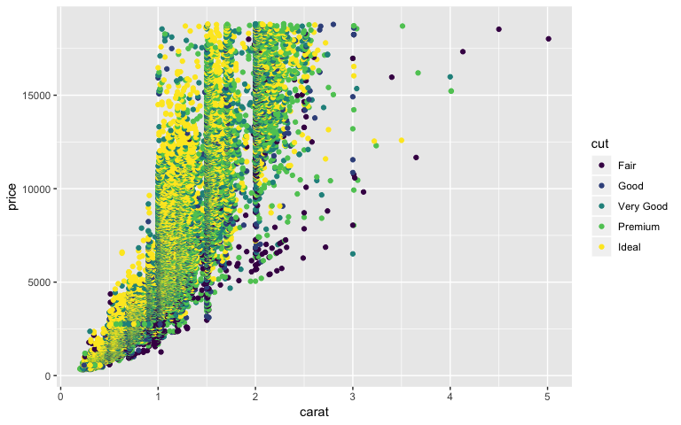
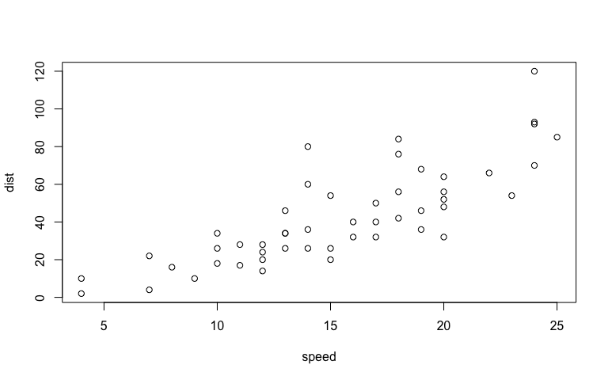
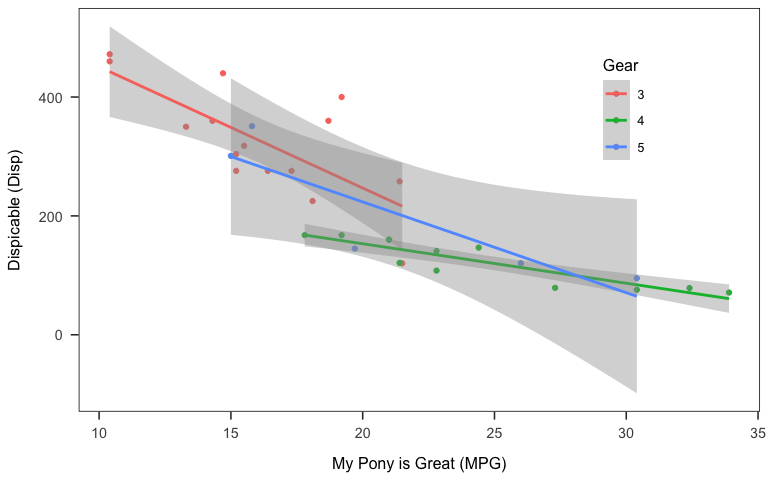

# R environment 


# Structure 
## 1. Header  
### Metadata in the Header (YAML)  


translate the argument into YAML using `yaml::as.yaml`.  

```r
cat(yaml::as.yaml(list(
  title = "example document",
  author = "su so"
)))
```

```
## title: example document
## author: su so
```


## 2. Code chunks  
### Step 1. Insert code chunks
Keyboard shortcuts:  
- Ctrl + Alt + I (Windows)  
- Cmd + Option + I (Mac)

### Step 2. Define *chunk options*

#### Options for the output documents  
A full list of options available [here](https://yihui.name/knitr/options/).  

| chunk options     | description                                                  |
|-------------------|--------------------------------------------------------------|
| `eval`            | execute a code chunk?                                        |
| `echo`            | include the code in the output document?                     |
| `results`         | include the result of the code chunk in the output document?<br>use `results="asis"` for reporting<br>use `results="hide"` to hide the results|
| `warning`         | show warning messages in the output document?                |
| `message`         | show console messages in the output document?                |
| `include`         | show code & result in the output document? <br>equivalent to `echo=F, results='hide', warning=F, message=F`|
| `cache`           | save the output of a code chunk?                             |  
| `fig.width`       | figure width                                                 |
| `fig.height`      | figure height                                                |


#### Useful tips & tricks  
1. selective inclusion  

`echo=3:5` only shows lines from 3 to 5  

```r
x <- c("a", "b", "c") #3
y <- c(1:3) #4
cbind(x, y) #5
```

`echo=c(1, 3)` only shows the first and third lines  

```r
library("tidyverse") #1
x <- c("a", "b", "c") #3
```


2. using `child` option  
Specify which child document you want the following code chunk should be: `child = "child-doc.Rmd"`  


This is an example plot from a child document.  

```r
library(ggplot2)
qplot(carat, price, colour = cut, data = diamonds)
```

<!-- -->


### Step 3. Code away  
#### Plot  

```r
plot(cars)
```

<!-- -->

##### APA-formatted Plot  

```r
ggplot(mtcars, aes(x = mpg, y = disp, colour = as.factor(mtcars$gear))) +
  geom_point() +
  geom_smooth(method = "lm") +
  labs(x = "My Pony is Great (MPG)",
       y = "Dispicable (Disp)") +
  scale_color_discrete("Gear") +
  papaja::theme_apa(box = T) +
  theme(legend.position = c(0.8, 0.75))
```

<!-- -->

```r
ggsave("plot.png", width = 8, height = 5)
# unlink("plot.png")
```

*Or* import a figure from your local storage

```r
knitr::include_graphics(here("plot.png"))
```

<!-- -->


#### Table  
Create a table using `knitr::kable` 

```r
mtcars %>%
  summarise(n = n(),
            disp_mean = mean(disp, na.rm = T),
            disp_sd = sd(disp, na.rm = T)) %>%
  as.tibble() %>%
  knitr::kable(caption="Summary Table", digits = 2)
```


Table: Summary Table

  n   disp_mean   disp_sd
---  ----------  --------
 32      230.72    123.94

##### Tables for test statistics 

```r
knitr::kable(coef(summary(lm(disp ~ wt*as.factor(gear),
                             data = mtcars))),
             format = "html", digits = 2)
```

<table>
 <thead>
  <tr>
   <th style="text-align:left;">   </th>
   <th style="text-align:right;"> Estimate </th>
   <th style="text-align:right;"> Std. Error </th>
   <th style="text-align:right;"> t value </th>
   <th style="text-align:right;"> Pr(&gt;|t|) </th>
  </tr>
 </thead>
<tbody>
  <tr>
   <td style="text-align:left;"> (Intercept) </td>
   <td style="text-align:right;"> -50.16 </td>
   <td style="text-align:right;"> 56.99 </td>
   <td style="text-align:right;"> -0.88 </td>
   <td style="text-align:right;"> 0.39 </td>
  </tr>
  <tr>
   <td style="text-align:left;"> wt </td>
   <td style="text-align:right;"> 96.71 </td>
   <td style="text-align:right;"> 14.34 </td>
   <td style="text-align:right;"> 6.75 </td>
   <td style="text-align:right;"> 0.00 </td>
  </tr>
  <tr>
   <td style="text-align:left;"> as.factor(gear)4 </td>
   <td style="text-align:right;"> 26.55 </td>
   <td style="text-align:right;"> 80.74 </td>
   <td style="text-align:right;"> 0.33 </td>
   <td style="text-align:right;"> 0.74 </td>
  </tr>
  <tr>
   <td style="text-align:left;"> as.factor(gear)5 </td>
   <td style="text-align:right;"> -66.28 </td>
   <td style="text-align:right;"> 93.83 </td>
   <td style="text-align:right;"> -0.71 </td>
   <td style="text-align:right;"> 0.49 </td>
  </tr>
  <tr>
   <td style="text-align:left;"> wt:as.factor(gear)4 </td>
   <td style="text-align:right;"> -40.68 </td>
   <td style="text-align:right;"> 25.67 </td>
   <td style="text-align:right;"> -1.58 </td>
   <td style="text-align:right;"> 0.13 </td>
  </tr>
  <tr>
   <td style="text-align:left;"> wt:as.factor(gear)5 </td>
   <td style="text-align:right;"> 24.43 </td>
   <td style="text-align:right;"> 30.82 </td>
   <td style="text-align:right;"> 0.79 </td>
   <td style="text-align:right;"> 0.44 </td>
  </tr>
</tbody>
</table>


#### Sourcing an external .R script

```r
knitr::read_chunk(here::here("data_analysis", "data_cleaning.R"))
```


## 3. Text paragraphs  

### inline formatting  

[Basic formatting](https://rmarkdown.rstudio.com/authoring_basics.html)  
[Cheetsheat](https://www.rstudio.com/wp-content/uploads/2015/03/rmarkdown-reference.pdf)
[LaTex math symbols](http://web.ift.uib.no/Teori/KURS/WRK/TeX/symALL.html)  

#### extracting test statistics


#### Example  
$y_{ij}$ = $\beta_0 + \beta_1 MPG + \beta_2WT + \beta_3MPG*WT + e$

Step 1. Run and save your analysis  

```r
knitr::kable(broom::tidy(summary(lm.fit <- lm(disp ~ mpg*wt,
                     data = mtcars))), 
             format = "markdown", digits = 3)
```


|term        | estimate| std.error| statistic| p.value|
|:-----------|--------:|---------:|---------:|-------:|
|(Intercept) |   48.552|   130.463|     0.372|   0.713|
|mpg         |   -1.106|     4.609|    -0.240|   0.812|
|wt          |  114.085|    29.827|     3.825|   0.001|
|mpg:wt      |   -2.726|     1.685|    -1.617|   0.117|


Step 2. Use `summary(fit)$coefficients` to extract information   

|                     | r code                           | output                                |
|---------------------|----------------------------------|---------------------------------------|
| **coefficients**    | `summary(fit)$coefficients[ ,1]` | -1.1056379|
| **Standard errors** | `summary(fit)$coefficients[ ,2]` | 4.6092387|
| **test statistics** | `summary(fit)$coefficients[ ,3]` | -0.2398743|
| **p-values**        | `summary(fit)$coefficients[ ,4]` | 0.8121751| 
| **R squared**       | `summary(fit)$r.squared`         | 0.8285675         |


- coefficients & p-values:  
  ...a negative slope of MPG, $\beta$ = -1.11, $p$ = 0.81.  

- r-squared:  
  $R^2$ = 0.8285675.  


### Citing references  
#### Useful tools  
1. citr add-in  

```r
# install.packages("citr")
options(citr.use_betterbiblatex = T)
```

2. papja    
- Step 1. export a bib file from your reference manager (e.g., Mendeley, Zotero)  
- Step 2. `papaja::r_refs` to create a bib file   
  + .bib file will include citations for R and R packages used in the session.  

```r
papaja::r_refs(file = "zotero_ref.bib", append = T)
```

- Step 3. `papja::cite_r` to translate them into human-readable citations  

```r
citations <- papaja::cite_r(file=here("workflow", "zotero_ref.bib")
                    #, pkgs = c("papaja", "here")
                    #, withhold = F
                    #, footnote = T
                    )
```
I used R [Version 3.5.1; @] and the R-packages *}base* [@}R-base], *bindrcpp* [Version 0.2.2; @R-bindrcpp], *broom* [Version 0.5.0; @R-broom], *corrplot2017* [@R-corrplot2017], *dplyr* [Version 0.7.7; @R-dplyr], *forcats* [Version 0.3.0; @R-forcats], *ggplot2* [Version 3.1.0; @R-ggplot2], *here* [Version 0.1; @R-here], *knitr* [Version 1.20; @R-knitr], *papaja* [Version 0.1.0.9842; @R-papaja], *purrr* [Version 0.2.5; @R-purrr], *readr* [Version 1.1.1; @R-readr], *shiny* [Version 1.2.0; @R-shiny], *stringr* [Version 1.3.1; @R-stringr], *tibble* [Version 1.4.2; @R-tibble], *tidyr* [Version 0.8.2; @R-tidyr], and *tidyverse* [Version 1.2.1.9000; @R-tidyverse] for the data analysis.

#### Citing step-by-step  
1. Add the .bib file in the same folder as the .Rmd file  

2. Add the following lines in the YAML header:  

```r
---
bibliography: reference.bib
csl: apa.csl
---
```

3. cite away using *citation keys* (optional: with citr addin)  
- in-line citation  
  ... @joel_wanting_2017 [p. 33] did things

- multiple citations separated by a **`;`**  
  ... [see @baldwin_relational_1992; also @joel_wanting_2017]

- removing author names by putting a minus sign, **`-`**  
  ... Joel [-@joel_wanting_2017] did things  

### Reproducibility


```r
print(sessionInfo(), locale = FALSE)
```

```
## R version 3.5.1 (2018-07-02)
## Platform: x86_64-apple-darwin15.6.0 (64-bit)
## Running under: macOS  10.14.1
## 
## Matrix products: default
## BLAS: /Library/Frameworks/R.framework/Versions/3.5/Resources/lib/libRblas.0.dylib
## LAPACK: /Library/Frameworks/R.framework/Versions/3.5/Resources/lib/libRlapack.dylib
## 
## attached base packages:
## [1] stats     graphics  grDevices utils     datasets  methods   base     
## 
## other attached packages:
##  [1] bindrcpp_0.2.2       knitr_1.20           here_0.1            
##  [4] forcats_0.3.0        stringr_1.3.1        dplyr_0.7.7         
##  [7] purrr_0.2.5          readr_1.1.1          tidyr_0.8.2         
## [10] tibble_1.4.2         ggplot2_3.1.0        tidyverse_1.2.1.9000
## 
## loaded via a namespace (and not attached):
##  [1] tidyselect_0.2.5  haven_1.1.2       lattice_0.20-35  
##  [4] colorspace_1.3-2  htmltools_0.3.6   viridisLite_0.3.0
##  [7] yaml_2.2.0        rlang_0.3.0.1     pillar_1.3.0     
## [10] glue_1.3.0        withr_2.1.2       modelr_0.1.2     
## [13] readxl_1.1.0      bindr_0.1.1       plyr_1.8.4       
## [16] munsell_0.5.0     gtable_0.2.0      cellranger_1.1.0 
## [19] rvest_0.3.2       codetools_0.2-15  evaluate_0.12    
## [22] labeling_0.3      papaja_0.1.0.9842 highr_0.7        
## [25] broom_0.5.0       Rcpp_1.0.0        scales_1.0.0     
## [28] backports_1.1.2   jsonlite_1.5      hms_0.4.2        
## [31] digest_0.6.18     stringi_1.2.4     grid_3.5.1       
## [34] rprojroot_1.3-2   cli_1.0.1         tools_3.5.1      
## [37] magrittr_1.5      lazyeval_0.2.1    crayon_1.3.4     
## [40] pkgconfig_2.0.2   xml2_1.2.0        lubridate_1.7.4  
## [43] assertthat_0.2.0  rmarkdown_1.10    httr_1.3.1       
## [46] rstudioapi_0.8    R6_2.3.0          nlme_3.1-137     
## [49] compiler_3.5.1
```


\newpage
# References
